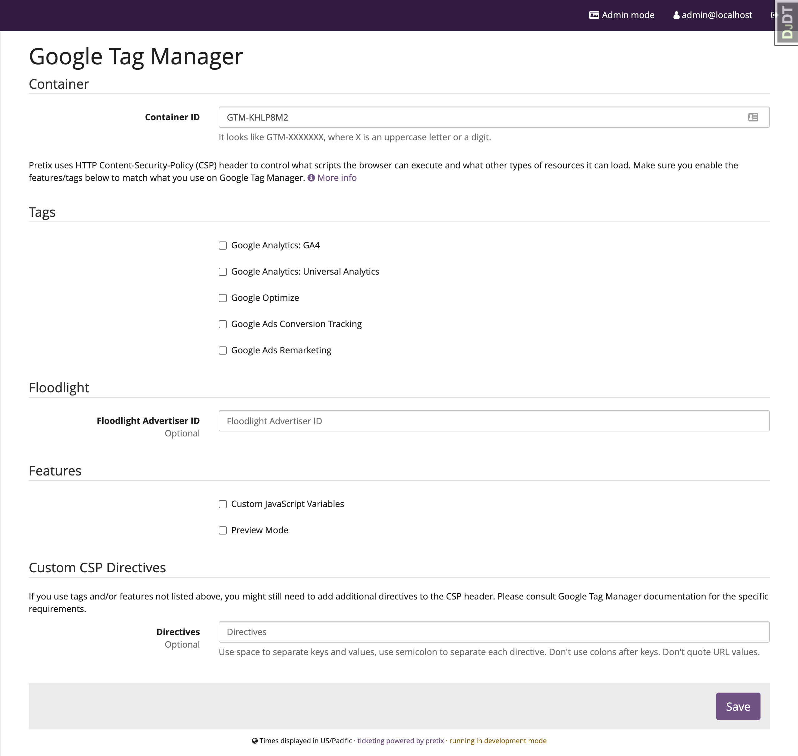
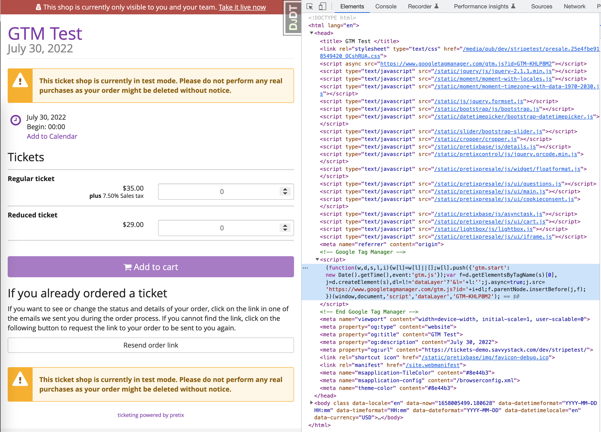
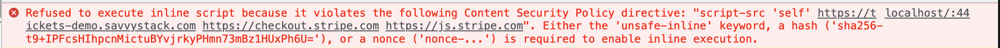

Google Tag Manager
==========================

This is a plugin for `pretix`_. It adds Google Tag Manager support to the pretix storefront.

Experiment with it
------------------

Once installed, you can enable "Google Tag Manager" on a per event basis. Once enabled, you'll see the "Tag Manager" nav link under Event Settings:

Enter your Container ID, refresh your storefront, you should be able to find the Google Tag Manager snnipet with your container ID in the ``<head>`` portion of the HTML.

If you aren't receiving tracking events from the tag you added on GTM, check the ``console`` tab for CSP (Content Security Policy) errors:

Caveats
-------

This plugin is still work in progress. Here are the top priorities on my to-do list:

1. Review any user specific information sent to the tracking services.
2. Implement mechanism to bypass tracking if the user chooses to opt-out.
3. Add custom events to track the checkout flow with better accuracy.

Given the status of this project, it might *not* be suited for production, depending on your local laws and regulations.

So stay tuned.

Compared to "Tracking codes"
----------------------------

This plugin is by no means a replacement to the `Tracking Codes plugin <https://marketplace.pretix.eu/products/tracking/>`_ by rami.io and Raphael Michel. 
Please take a look and seriously consider supporting Raphael and his team.

Development setup
-----------------

If you'd like to fork this project and add tracking events specific to your needs, please follow the following steps to set up your development environment.

1. Make sure that you have a working `pretix development setup`_.

2. Clone this repository.

3. Activate the virtual environment you use for pretix development.

4. Execute ``python setup.py develop`` within this directory to register this application with pretix's plugin registry.

5. Execute ``make`` within this directory to compile translations.

6. Restart your local pretix server. You can now use the plugin from this repository for your events by enabling it in
   the 'plugins' tab in the settings.

This plugin has CI set up to enforce a few code style rules. To check locally, you need these packages installed::

    pip install flake8 isort black docformatter

To check your plugin for rule violations, run::

    docformatter --check -r .
    black --check .
    isort -c .
    flake8 .

You can auto-fix some of these issues by running::

    docformatter -r .
    isort .
    black .

To automatically check for these issues before you commit, you can run ``.install-hooks``.

License
-------

Copyright 2022 Savvy Stack, Inc.

Released under the terms of the Apache License 2.0

.. _pretix: https://github.com/pretix/pretix
.. _pretix development setup: https://docs.pretix.eu/en/latest/development/setup.html
